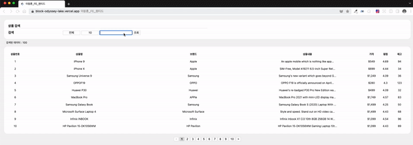
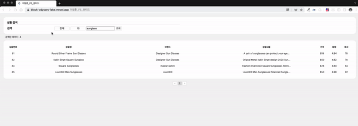
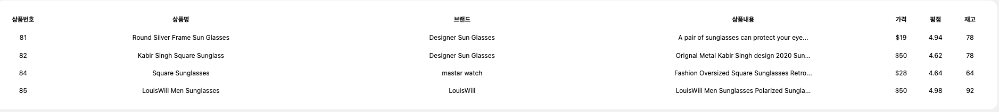
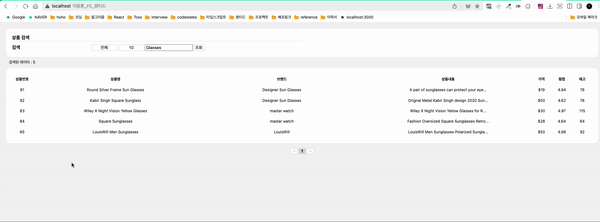
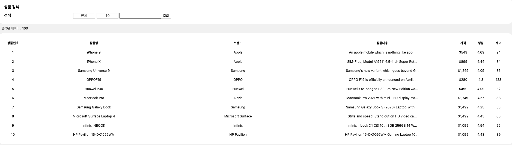
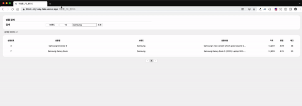
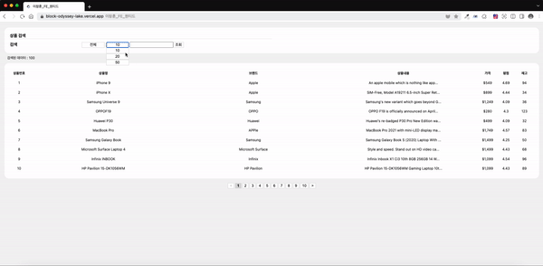
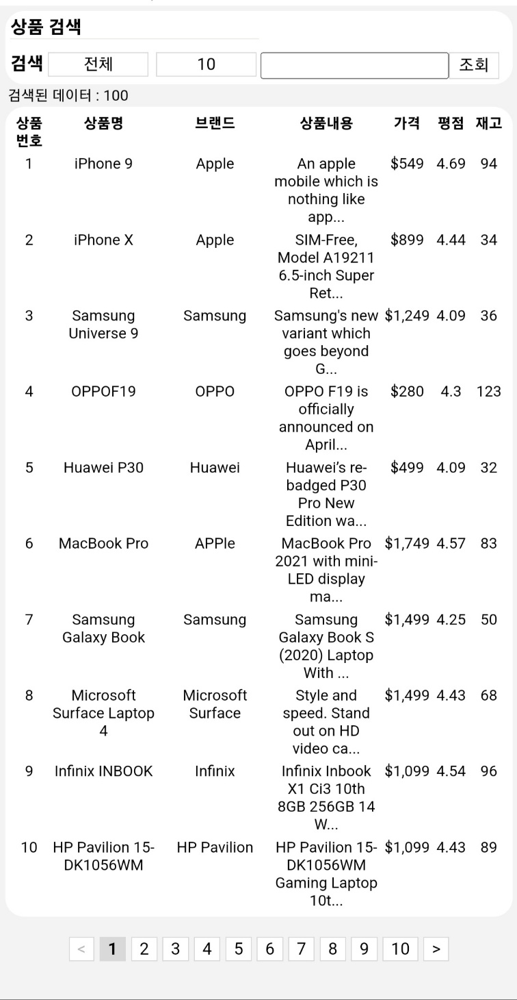

# 이창훈_프론트엔드_원티드
## **✨ 배포 링크**
### [배포링크바로가기](https://block-odyssey-lake.vercel.app/)

## Required Tasks
- It should be a search result list.

   
  
   

- After page refresh, the search result should persist.

   
  
   

- The column is in order of [상품번호, 상품명, 브랜드, 상품내용, 가격, 평점, 재고].

   
  
   

- Search conditions are the following : [전체, 상품명, 브랜드, 상품내용].

   
  
   

- Display the total amount of data at the top of the list.

   
  
   

- Both search condition and keyword must be persisted after the refresh. 

   
  
   

- Implement rows per page using a select box. The select box should display [10, 20, 50] options. 

   
  
   

## Other Tasks
-  모바일 환경에서도 화면 비율을 유지하도록  반응형으로 디자인하였습니다. 

   
  
   

- Next.js의 SSR을 사용하였습니다. 

   
  
   

## **🛠 Dev Tools**

 
 

##  **🌱 commit message 규칙**

커밋 규칙

⭐ feat : 새로운 기능에 대한 커밋

🎨 ui : 새로운 CSS관련 디자인에 대한 커밋

🛠 fix : 버그 수정에 대한 커밋

🧱 build : 빌드 관련 파일 수정에 대한 커밋

👏 chore : 파일 이동, 파일명 수정, 변수 제거 등의 자잘한 수정에 대한 커밋

⚒ refactor : 코드 리팩토링에 대한 커밋

📝 style : 공백 제거와 같은, 코드 스타일 혹은 포맷 등에 관한 커밋

✏ docs : 문서 수정에 대한 커밋

💡 ci : CI관련 설정 수정에 대한 커밋

## 📚 사용 Library

Lib List

### production
- react v18
- next.js
- react-query
- sass

